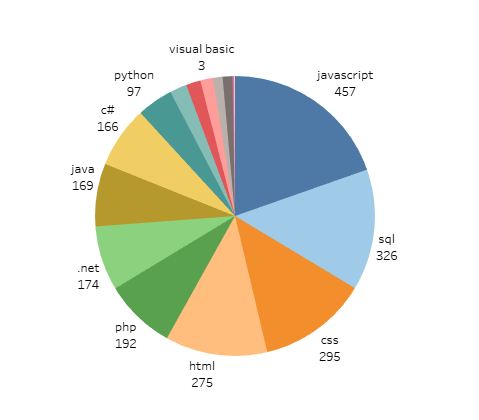
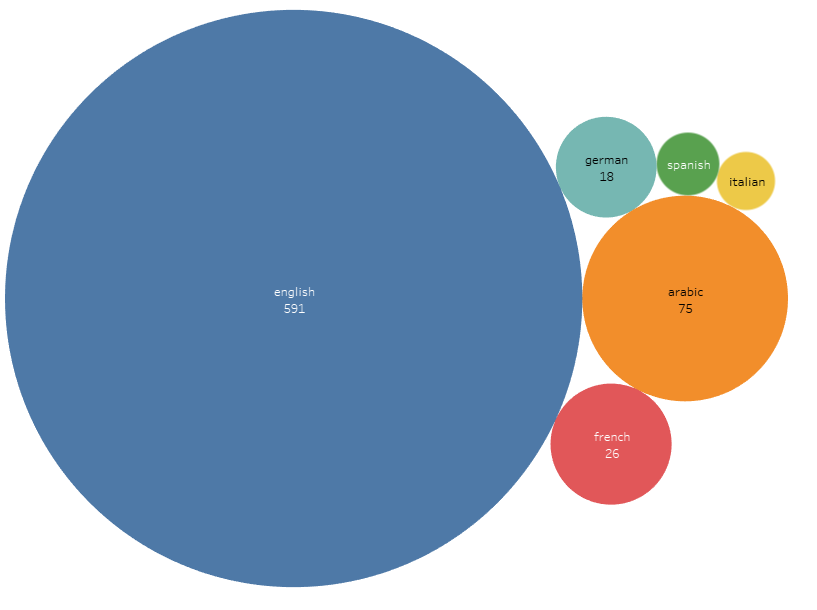

# Wuzzuf IT Jobs Visualization

[![GitHub Release][github_release_badge]][github_release_link]
[![License][license-image]][license-url]

Data Collection and visualization for jobs offered under the IT section on [Wuzzuf](wuzzuf.net) for educational and statistical purposes.

> DISCLAIMER: Wuzzuf doesn't offer an open API to obtain the required data for the visualization and as such a web scraper ***with a delay between requests*** was used to obtain the data

## Visualization

You can view the whole visualization on [Tableau public](https://public.tableau.com/views/WuzzufITOffersVisualization/MainDashboard?:language=en&:display_count=y&:origin=viz_share_link)







## Download Data

You can download previously collected data from this [drive][data-drive]. It should be updated every month (or a couple of month) so check back from time to time.

## Installation

Don't forget to install the required modules.

```bash
pip install -r requirements.txt
```

## Usage

To obtain the data. Run the python module as follows:

> Note that because of the delay added between requests the script will take a long time to gather the data. Please be responsible and don't remove the delay.

You can also download some older data in the [Download Data](#download-data) Section.

```bash
py -m Wuzzuf_DataCollection
```

There are also command args available which you can view with:

```bash
py -m Wuzzuf_DataCollection --help

usage: __main__.py [-h] [-l] [-i START_INDEX] [-e END_INDEX] [-c] [-f]

Gets the list of Job offers on wuzzuf.com for it, gets the details of each offer then generates a CSV file with all the jobs Warning: the output file is overwritten with each run!!

optional arguments:
  -h, --help            show this help message and exit
  -l, --use-existing-Links-file
                        Use the existing links JSON file (default: False)
  -i START_INDEX, --start-index START_INDEX
                        Start index in links JSON to start getting job info (Inclusive, default: 0)
  -e END_INDEX, --end-index END_INDEX
                        Start index in links JSON to start getting job info (Exclusive)
  -c, --skip-create-csv
                        Create CSV files combining data from Job JSONs (default: False)
  -f, --skip-get-jobs-info
                        Create JSON files for each job (or jobs within the start and end index if specified) in links JSON file (default: False)

https://github.com/TheDigitalPhoenixX/Wuzzuf-IT-Jobs-Visualization
```

### Using docker

```bash
docker-compose up
```

## Built With

* [Tableau Public](https://public.tableau.com) - Data Visualization tool
* [Visual Studio Code](https://code.visualstudio.com/) - Code Editor
* [Docker](https://www.docker.com/) - Containerization

## Versioning

We use [SemVer](http://semver.org/) for versioning. For the versions available, see the [tags on this repository][github-tags].

## Authors

* **Mohamed Said Sallam** - Main Dev - [TheDigitalPhoenixX](https://github.com/TheDigitalPhoenixX)
* **Sameh Amnoun** - Main Dev - [SamehAmnoun](https://github.com/SamehAmnoun)

See also the list of [contributors][github-contributors] who participated in this project and their work in [CONTRIBUTORS.md](CONTRIBUTORS.md).

## License

This project is licensed under the MIT License - see the [LICENSE](LICENSE) file for details

## Acknowledgments

* [README.md Template](https://gist.github.com/PurpleBooth/109311bb0361f32d87a2)

[license-image]: https://img.shields.io/badge/License-MIT-brightgreen.svg
[license-url]: https://opensource.org/licenses/MIT

[github_release_badge]: https://img.shields.io/github/v/release/TheDigitalPhoenixX/Wuzzuf-IT-Jobs-Visualization.svg?style=flat&include_prereleases
[github_release_link]: https://github.com/TheDigitalPhoenixX/Wuzzuf-IT-Jobs-Visualization/releases

[github-contributors]: https://github.com/TheDigitalPhoenixX/Wuzzuf-IT-Jobs-Visualization/contributors
[github-tags]: https://github.com/TheDigitalPhoenixX/Wuzzuf-IT-Jobs-Visualization/tags

[data-drive]: https://drive.google.com/drive/folders/19DFHc4DF35bMF_mOlFGV1cd8hvQOCVeM?usp=sharing
